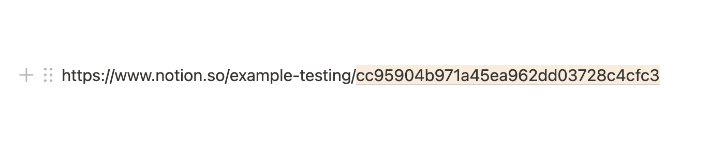

# Lyric Generator for Notion

This app scans Notion blocks on a given page ID for "song title - song artist;"

While that line has the ";", it will generate the lyrics to the song and add it at the bottom of the page. 

Uses the Notion and Genius API.

Modified from https://github.com/makenotion/notion-sdk-js/tree/main/examples/parse-text-from-any-block-type

## Running Locally

### 1. Setup your local project

```zsh
# Clone this repository locally
git clone https://github.com/amarcin/notion-lyrics-app.git

# Switch into this project
cd notion-lyrics-app

# Install the dependencies
npm install
```

### 2. Set your environment variables in a `.env` file

A `.env.example` file has been included and can be renamed `.env`. Update the environment variables below:

```zsh
NOTION_API_KEY=<your-notion-api-key>
NOTION_PAGE_ID=<notion-page-id>
GENIUS_API_KEY=<genius-api-key>
```

`NOTION_API_KEY`: Create a new integration in the [integrations dashboard](https://www.notion.com/my-integrations) and retrieve the API key from the integration's `Secrets` page.

`NOTION_PAGE_ID`: Use the ID of any Notion page with content. A page with a variety of block types is recommended.

The page ID is the 32 character string at the end of any page URL.


### 3. Give the integration access to your page

Your Notion integration will need permission to retrieve the block children from the Notion page being used. To provide access, do the following:

1. Go to the page in your workspace.
2. Click the `•••` (more menu) on the top-right corner of the page.
3. Scroll to the bottom of the menu and click `Add connections`.
4. Search for and select your integration in the `Search for connections...` menu.

Once selected, your integration will have permission to read content from the page.

### 4. Run code

```zsh
node index.js
```
